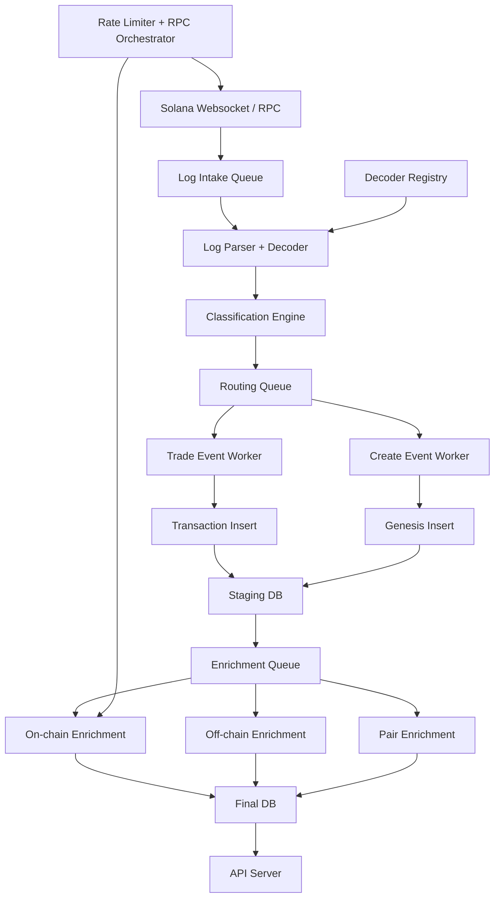

# solcatcher

**A distributed, queue-driven event processing system for real-time blockchain data.**

Processes high-frequency Solana log streams, performs deterministic decoding and classification, and persists structured data through a staged, fault-isolated pipeline designed for resilience and continuous operation.

> Designed to handle continuous log ingestion with burst traffic patterns, using queue backpressure and worker isolation to maintain stability under load.

---

## System Characteristics

Designed as a production-grade data pipeline with explicit guarantees:

- **Fault Isolation** — failures are contained within individual pipeline stages and never cascade
- **Deterministic Processing** — all stages operate on typed, reproducible inputs
- **Idempotent Recovery** — safe reprocessing without duplication or corruption
- **Backpressure Control** — queue-based architecture regulates throughput under burst load
- **Read/Write Isolation** — dual-database model prevents ingestion from impacting query performance
- **Progress Over Perfection** — partial failures are tolerated and resolved through later enrichment passes

---

## What This System Is (in practical terms)

This is not a scraper or analytics script.

It is a **continuous ingestion and processing pipeline**:

- Consumes real-time blockchain logs
- Transforms raw data into structured domain events
- Routes work through isolated processing stages
- Enriches data asynchronously
- Persists results in a query-optimized datastore

The system is designed to run indefinitely under load, with explicit handling for failure, retries, and degraded upstream conditions.

---

## Architecture Overview

Queue-driven pipeline with strict stage separation:

Each stage operates independently, is observable, and can fail without affecting upstream stages.

---

## Failure Model

Failures are expected and designed for.

- Errors are **contained**, not propagated
- Work is **retried or deferred**, not lost
- State is **persisted incrementally**
- Systems **degrade gracefully** under upstream issues

The pipeline prioritizes **forward progress** over strict completion, allowing missing data to be resolved asynchronously.

---

## AWS Equivalent Architecture

This system mirrors common cloud-native patterns:

| Solcatcher                        | AWS Equivalent                |
| --------------------------------- | ----------------------------- |
| RabbitMQ queues                   | SQS                           |
| Worker handlers                   | Lambda / ECS                  |
| Express API                       | API Gateway + Lambda          |
| PostgreSQL (staging / final)      | RDS                           |
| RPC orchestration                 | API Gateway + circuit breaker |
| Rate limiter registry             | DynamoDB                      |
| Websocket ingestion               | Kinesis / API Gateway WS      |

The system is implemented directly on self-managed infrastructure, providing full control over execution, failure handling, and performance characteristics.

---

## Key Properties

- **Queue-driven pipeline** — explicit stage separation and flow control
- **Typed end-to-end** — schemas enforced from ingestion to persistence
- **Dual-database model** — staging (writes) + final (reads)
- **Decoder registry** — version-aware, multi-IDL event decoding
- **RPC orchestration layer** — rate limiting + circuit breaker + fallback routing
- **API-agnostic** — operates without external dependencies, integrates when beneficial
